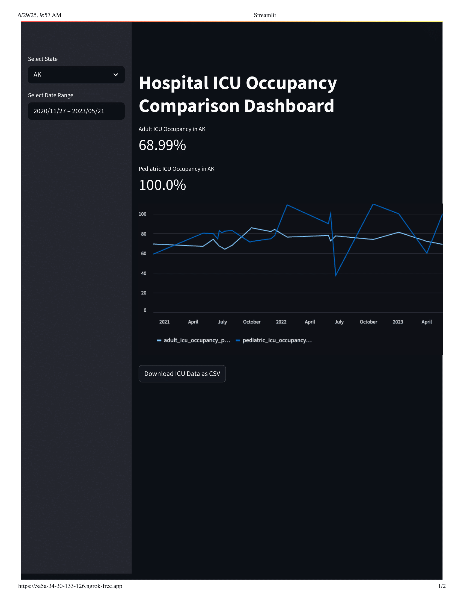

# 🏥 Real-Time Hospital ICU Occupancy Dashboard

An interactive **Streamlit dashboard** to monitor and compare **Adult and Pediatric ICU occupancy** across U.S. states.  
It provides visual insights into ICU utilization trends and supports data-driven decision-making in healthcare resource management.

---

## 📊 Overview
The dashboard enables:
- Real-time visualization of **ICU capacity vs occupancy**
- Filtering by **state** and **date range**
- **Side-by-side comparison** of Adult and Pediatric ICUs
- Exporting filtered data to **CSV** for further analysis

This project highlights data engineering, preprocessing, and visualization skills using **Python**, **Pandas**, and **Streamlit**.

---

## ⚙️ Tech Stack
| Category | Tools / Libraries |
|-----------|------------------|
| Language | Python |
| Visualization | Streamlit |
| Data Handling | Pandas |
| Data Source | Cleaned CSV datasets (Adult & Pediatric ICU) |
| Version Control | Git & GitHub |

---

## 🧱 Project Structure
```
📁 real-time-hospital-icu-dashboard/
│
├── app.py # Streamlit application script
├── adult_icu_cleaned.csv # Adult ICU dataset
├── pediatric_icu_cleaned.csv # Pediatric ICU dataset
├── Streamlit-1.png # Dashboard preview image
└── README.md # Project documentation

```
---

## 📈 Data Description
| Column | Description |
|---------|--------------|
| `date` | Observation date |
| `state` | U.S. state abbreviation |
| `icu_capacity` | Total available ICU beds |
| `icu_occupied` | Total occupied ICU beds |
| `icu_utilization_pct` | Occupied / Capacity × 100 |

These datasets are preprocessed snapshots of ICU occupancy data originally available from **HHS Protect / HealthData.gov**.

---

## 🚀 How It Works
1. **Loads** adult and pediatric ICU datasets into Pandas DataFrames.  
2. **Filters** by user selections (state & date range).  
3. **Calculates** utilization percentage for both groups.  
4. **Visualizes** the trends interactively using Streamlit charts.  
5. **Exports** filtered data to CSV via a download button.

---

## 📷 Sample Output


---

## 🩺 Insights
- Displays real-time trends for ICU utilization.
- Highlights **resource strain** between Adult and Pediatric ICUs.
- Enables rapid data exploration for healthcare planners.

---

## 🧠 Learning Outcomes
- Building interactive dashboards using Streamlit.  
- Cleaning and visualizing real-world healthcare data.  
- Structuring a reproducible analytics project for GitHub portfolios.

---

## 👤 Author
**Guru Kavya Sree Gopireddy**  
_Data Analyst | Healthcare Analytics | Python | Streamlit_  
📍 [LinkedIn](https://www.linkedin.com/in/guru-kavya-sree-gopireddy) • [GitHub](https://github.com/gopireddy2001)

---

## 📜 License
This project is open-source under the **MIT License**.  
Feel free to fork, modify, and build upon it.
